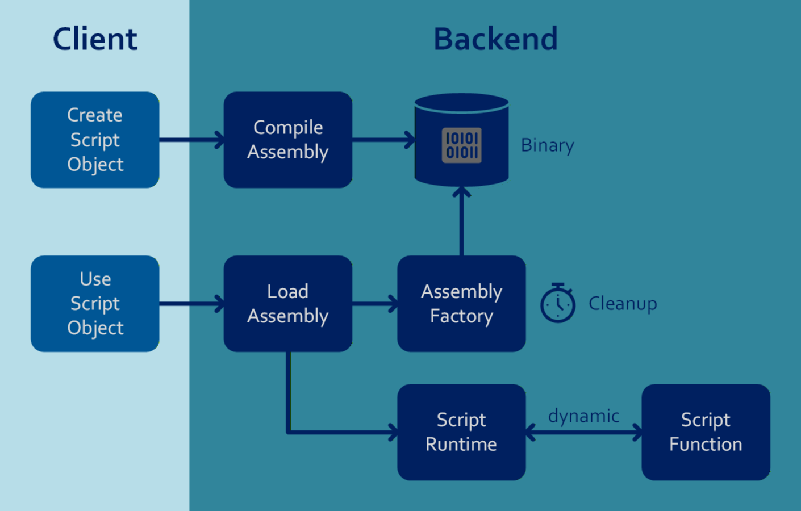
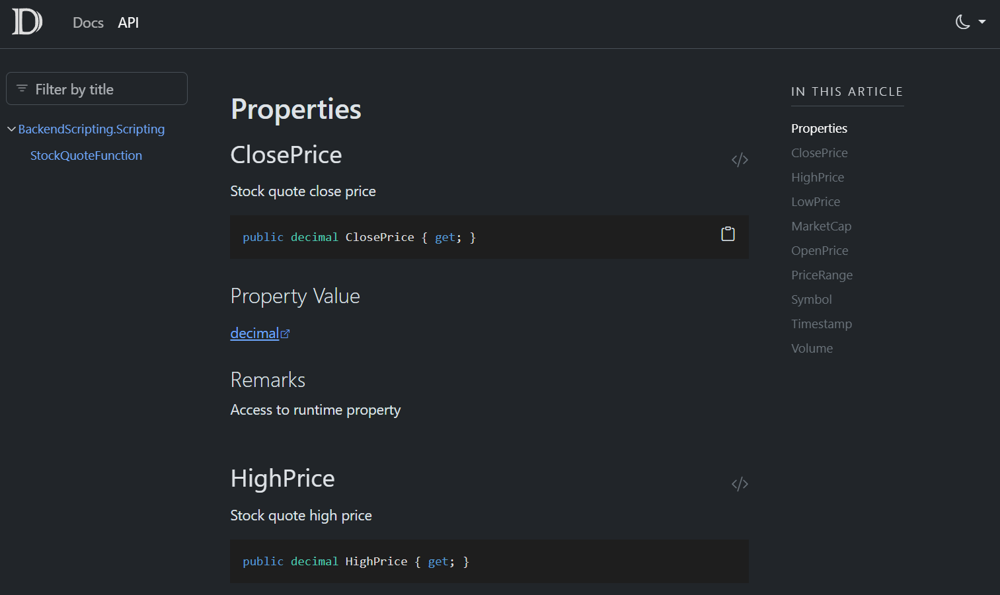

# High-performance backend scripting for .NET

The following solution presents an approach that allows C# scripts to be executed efficiently in the backend.
This decouples the implementation of the business logic from the backend code.

The following criteria were taken into account when implementing the scripting API:

| Performance                              | Stability                                                 | Script development |
|:--:|:--:|:--:|
| The scripts are executed at the fastest possible speed to ensure fast response times and reduce the use of infrastructure resources.           | The scripts do not affect backend execution.                           | Comprehensible script syntax and API documentation. |

The solution involves dividing the use of backend scripts into two phases: **creation** and **use**.



During the **creation** phase, the script is compiled into an assembly and stored in the database as binary data. This allows syntax or type errors to be identified early on, ensuring that only executable code is fed in.

During the **usage** phase, the assembly is loaded from the database and executed in a controlled manner within a runtime environment. Unused assemblies are removed from the back-end cache after a certain period of time.

| This approach is suitable for             | This approach is not suitable for         |
|:--:|:--:|
| Computationally intensive backend systems | Ongoing changes to business logic         |
| Financial trading platforms               | Highly parallel I/O (real-time)           |
| AI and machine learning services          | Microservice architecture                 |
| Real-time simulations and CAD systems     | Maximum speed to MVP/time-to-market       |

### Application example
This article provides a customisable evaluation of stock quotes based on the `StockQuote`, `StockQuoteScript` and `StockQuoteResult` objects.

The usage consists of the following sequence:
1. Create stock quotes.
2. Create evaluation scripts.
3. Analyze stock quotes.

> Note: This application is for illustrative purposes only and should not be used with any production systems.

#### 1. Create Stock Quotes
Use the `POST` endpoint `quotes/mock` to create `StockQuote` mock entries. The `count` parameter determines the number of entries created.
By default, `2,000` entries are generated.

#### 2. Create evaluation scripts
You can create and update a `StockQuoteScript` object using the `quotes/scripts` endpoint.

The following scripts were selected for this example:

| Name                    | Script                                               |
|:--|:--|
| Price Volatility        | `(PriceRange) / OpenPrice`                           |
| Breakaway Check         | `(HighPrice <= LowPrice * 1.2m) ? 1 : null`          |
| Intraday Return         | `if (OpenPrice == 0) return 0; `<br /> `return (ClosePrice - OpenPrice) / OpenPrice` |
| Typical Price           | `HighPrice + LowPrice + ClosePrice) / 3`             |
| Raw Money Flow          | `((HighPrice + LowPrice + ClosePrice) / 3) * Volume` |
| Upper Shadow Percentage | `var maxBody = Math.Max(OpenPrice, ClosePrice); `<br />`return maxBody == 0 ? null : (HighPrice - maxBody) / maxBody` |

> The evaluation examples can be found in the file `StockQuoteScripts.json`.

#### 3. Analyze stock quotes
The `POST` endpoint `quotes/scripts/{scriptId}/evaluate` starts evaluating a script. The script calculates the value for each `StockQuote` and stores it as a `StockQuoteResult`. If the script's result is undefined (`null`), no result is stored.

The results of the script can be listed using the `GET` endpoint`quotes/{quoteId}/scripts/{scriptId}`. The durations of the processing steps can be seen in the log file `log.txt`.

#### Performance Results
Performance testing was conducted on the following computer:
- Processor: Intel Core i7-10875H CPU @ 2.30GHz
- RAM: 32 GB
- HD: 500 GB SSD
- OS: Windows 11 Pro, version 25H2
- Database: Microsoft SQL Server 15.0.2155.2
- .NET 10.0.102

The following results show the time required to evaluate **100,000** stock quotes:

| Script                  | Load (ms)  | Evaluate (ms) | Store (ms) <sup>1)</sup> |
|----|:--:|:--:|:--:|
| Price Volatility        | 102        | 260           | 557          |
| Breakaway Check         | 109        | 244           | 335          |
| Intraday Return         | 113        | 211           | 567          |
| Typical Price           | 107        | 232           | 602          |
| Raw Money Flow          | 88         | 220           | 597          |
| Upper Shadow Percentage | 86         | 268           | 613          |

The execution times for **1,000,000** stock quotes are as follows:

| Script                  | Load (ms)  | Evaluate (ms) | Store (ms) <sup>1)</sup> |
|----|:--:|:--:|:--:|
| Price Volatility        | 1292       | 2271          | 6028         |
| Breakaway Check         | 1000       | 2096          | 3612         |
| Intraday Return         | 988        | 2259          | 6520         |
| TypicalPrice            | 1064       | 2203          | 5636         |
| Raw Money Flow          | 1051       | 2199          | 6093         |
| Upper Shadow Percentage | 907        | 2317          | 5565         |

<sup>1)</sup> The results are stored in bulk.<br />

| Conclusion |
|:--:|
| On average, they demonstrate a consistently high processing speed of **2,500 nanoseconds per stock quote**.<br />However, scripts with I/O queries increase processing time. |

### Backend Implementation
The solution is divided into the following projects:
- `Model`: Stock Quote Object Model.
- `Scripting` with the compiler and scripting runtime/function.
- `Persistence` Database context and repositories.
- `Server`: Stock quote services, DTOs, and endpoints.

#### Persistence
SQL Server is used to store the data. The stock quote database uses the following model:


The database schema can be generated using the `Database/ModelCreate.sql` file in the GitHub repository.

> The lightweight [Dapper](https://github.com/DapperLib/Dapper) is used as the ORM.

The following repositories are available:
- `StockQuoteRepository`: Read, create, and delete stock quotes.
- `StockQuoteScriptRepository`: Read, create, update, and delete stock quote scripts.
    - Script compilation takes place when the object is created and updated.
- `StockQuoteResultRepository`: Read, create, and delete stock quote results.
    - Due to the large amount of data, stock quote results are generated in [bulk mode](https://learn.microsoft.com/en-us/dotnet/api/system.data.sqlclient.sqlbulkcopy).

#### Script Compiler
The script compiler uses [Roslyn](https://github.com/dotnet/roslyn) to generate a .NET assembly for each script.
The assembly's binary data and the script's hash value are stored in the database with the script object.
The hash code is used for assembly caching.

The following example shows how to create a stock quote script using the `StockQuoteScriptRepository` method `AddAsync()`.

```csharp
public async Task<int?> AddAsync(StockQuoteScript stockQuoteScript)
{
    const string sql = "INSERT INTO StockQuoteScript(Name, Script, Binary, ScriptHash)" +
                       " VALUES(@Name, @Script, @Binary, @ScriptHash);" +
                       " SELECT CAST(SCOPE_IDENTITY() as int)";

    try
    {
        // script compile: setup binary and script hash
        StockQuoteCompiler.Compile(stockQuoteScript);
    }
    catch (ScriptCompileException exception)
    {
        Log.Error(exception, exception.GetBaseException().Message);
        return null;
    }

    // create quote stock script
    using var connection = DbContext.Create();
    var result = await connection.ExecuteScalarAsync<int>(sql, stockQuoteScript);
    return result;
}
```

The assembly binary data and the script hash are backend attributes not included in the API DTO.
```csharp
public sealed record CreateStockQuoteScriptRequest(
    string Name,
    string Script);
```

#### Script Runtime
The runtime isolates the script function from the backend and controls the scripting process.

- Communication between the runtime and the function occurs via the `dynamic` object type.
    - Basic object types, such as `decimal` and `int`, as well as core objects, such as `Tuple` and `List`, can be used.
- The function has access to the public properties and methods of the runtime class.
- The function runs in its own task.
    - A `Timeout` prevents executions from taking too long.

```csharp
public class StockQuoteRuntime(StockQuote stockQuote, IScriptObject script, TimeSpan timeout)
{
    private StockQuote StockQuote { get; } = stockQuote;
    private IScriptObject Script { get; } = script;
    private TimeSpan Timeout { get; } = timeout;

    // properties
    public string Symbol => StockQuote.Symbol;
    public decimal OpenPrice => StockQuote.OpenPrice;
    public decimal HighPrice => StockQuote.HighPrice;
    public decimal LowPrice => StockQuote.LowPrice;
    public decimal ClosePrice => StockQuote.ClosePrice;
    public long Volume => StockQuote.Volume;
    public double MarketCap => StockQuote.MarketCap;
    public DateTime Timestamp => StockQuote.Timestamp;

    // methods
    public decimal GetYearAveragePrice() =>
        (decimal)Random.Shared.NextDouble() * (HighPrice - LowPrice) + LowPrice;

    public object? Evaluate() => InvokeScript();

    [MethodImpl(MethodImplOptions.NoInlining)]
    private object? InvokeScript()
    {
        try
        {
            var task = Task.Factory.StartNew<decimal?>(() =>
            {
                // create script
                using var script = CreateScript<StockQuoteFunction>(Script);
                // dynamic
                var value = script.Evaluate();
                return value;
            });
            return task.WaitScriptResult(typeof(StockQuoteFunction), Timeout);
        }
        catch (Exception exception)
        {
            throw new ScriptException($"Evaluation error in stock quote {StockQuote.Id}: "+
                                      $"{exception.GetBaseException().Message}.", exception);
        }
    }

    [MethodImpl(MethodImplOptions.NoInlining)]
    private dynamic CreateScript<TFunc>(IScriptObject scriptObject)
    {
        // load assembly
        var scriptType = typeof(TFunc);
        var assembly = AssemblyFactory.GetObjectAssembly(typeof(IScriptObject), scriptObject);
        var assemblyScriptType = assembly.GetType(scriptType.FullName ?? throw new InvalidOperationException());
        if (assemblyScriptType == null)
        {
            throw new ScriptException($"Unknown script type {scriptType}.");
        }

        // script function execution with runtime as constructor argument
        return Activator.CreateInstance(assemblyScriptType, this)!;
    }
}
```

> The attribute `MethodImpl(MethodImplOptions.NoInlining)` disables [inline optimization](https://learn.microsoft.com/de-de/dotnet/api/system.runtime.compilerservices.methodimploptions) for scripts.

The following rules must be observed when implementing the scripting runtime:
- Query data should be retrieved using keys on indexed database fields.
- Values that are queried multiple times from the function should be stored in a runtime cache.

#### Script Function
The script is embedded in the function class template for compilation.

In the Stock Quote example, the entry point is the `Evaluate` method, which requires a return value.
Therefore, the Stock Quote script must contain a `return` statement.

```csharp
public class StockQuoteFunction : IDisposable
{
    private dynamic Runtime { get; }
    public StockQuoteFunction(object runtime)
    {
        Runtime = runtime ?? throw new ArgumentNullException(nameof(runtime));
    }

    // properties
    public string Symbol => Runtime.Symbol;
    public decimal OpenPrice => Runtime.OpenPrice;
    public decimal HighPrice => Runtime.HighPrice;
    public decimal LowPrice => Runtime.LowPrice;
    public decimal ClosePrice => Runtime.ClosePrice;
    public long Volume => Runtime.Volume;
    public double MarketCap => Runtime.MarketCap;
    public DateTime Timestamp => Runtime.Timestamp;
    public decimal PriceRange => HighPrice - LowPrice;

    // methods
    public decimal GetYearAveragePrice() => Runtime.GetYearAveragePrice();

    public object? Evaluate()
    {
        // script placeholder
        #region Script
        #endregion

        return null;
    }

    public void Dispose() => GC.SuppressFinalize(this);
}
```

The following is an example of what a validation script could look like:
```csharp
public class StockValidateFunction : IDisposable
{
    public bool? Validate()
    {
        // script placeholder
        #region Script
        #endregion

        return null;
    }
}
```

The script function is a template that must be registered as an embedded resource within the C# project file.
```xml
<ItemGroup>
  <EmbeddedResource Include="StockQuoteFunction.cs">
	  <LogicalName>StockQuoteFunction.cs</LogicalName>
  </EmbeddedResource>
</ItemGroup>
```

#### Assembly Factory
The `AssemblyFactory` class loads and stores assemblies in the backend's memory for a specified period of time.
The retention period is determined by the `AssemblyCacheTimeout` application setting, which has a default value of 30 minutes. You can disable assembly caching by setting the timeout to zero.

If a cached script changes, you can remove the assembly using the `AssemblyFactory.InvalidateObjectAssembly()` method. In the stock quote example, this is done in the `StockQuoteScriptRepository.UpdateAsync()` method.

### Scripting Documentation
Users have access to HTML documentation describing the available properties and methods of the script function.
This reference is generated based on the source code [XML documentation](https://learn.microsoft.com/en-us/dotnet/csharp/language-reference/language-specification/documentation-comments).

The open-source tool DocFX (https://github.com/dotnet/docfx) was used to generate the documentation.



Steps to use the static HTML documentation:
1. Run the `BackendScripting.Scripting\docfx\Static.Build.cmd` command.
2. Run `BackendScripting.Scripting\docfx\Static.Start.cmd` to open the HTML start page.

Steps to use the web application:
1. Start the `BackendScripting.Scripting\docfx\Server.Start.cmd` command.
2. Open the URL http://localhost:5865 to access the start page.

### Technology
The following .NET and C# features were helpful in implementing this architecture:
- Strict type system.
- Native support for decimal numbers (`decimal`).
- Shared memory access (`dynamic`).
- An extensible metadata model that can be evaluated using reflection.
- Type extensions, such as operator overloading (DSL extensions).
- Runtime code generation and compilation with [Roslyn](https://github.com/dotnet/roslyn).
- Asynchronous execution with `async`/`await`.
- True native threads.
- Runtime-managed thread pooling.
- Highly optimized scheduling of tasks across CPU cores.
- A proven, open-source ASP.NET Core web server platform.

### GitHub Repository
This example can be found in the GitHub repository [BackendScripting](https://github.com/Giannoudis/BackendScripting).

The following components are used for illustration purposes:
- [Serilog](https://serilog.net/) for logging.
- [Bogus](https://github.com/bchavez/Bogus) for creating mock data.
- [Dapper](https://github.com/DapperLib/Dapper) as a database object mapper.
- [DocFx](https://github.com/dotnet/docfx) for creating scripting documentation.

### Outlook
This **low-code** approach paves the way for automatically converting **no-code** or **DSL** instructions into C# backend scripts.
